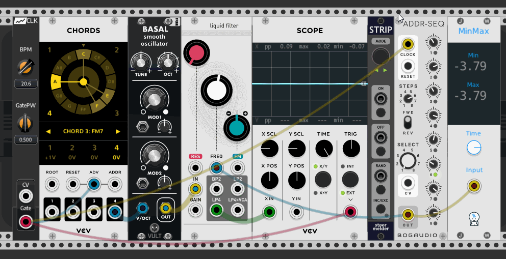
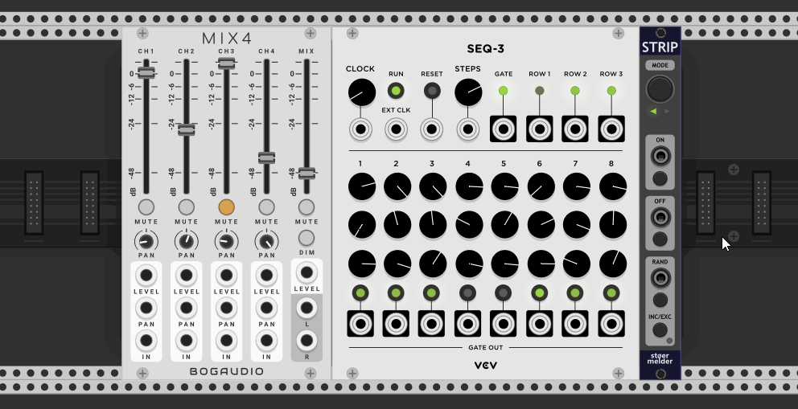
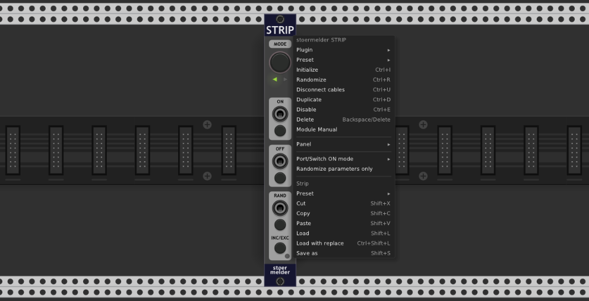
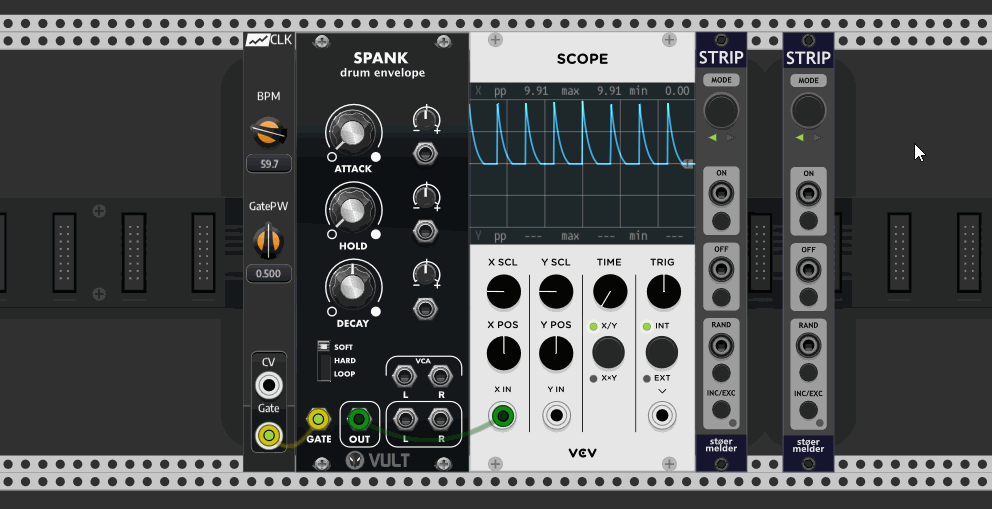

# stoermelder STRIP

STRIP is a module for managing a strip of modules. A "strip" is a group of modules formed in a single row of Rack without any empty spaces between them, directly next to STRIP on the left or right side. STRIP provides functionality to disable, to randomize and to save or load strips of modules. Copy and paste is possible, too.

STRIP uses Rack v1's expander-mechanism to traverse the modules in a group. Changing the modules in a strip is simply moving them a bit in Rack and creating an empty space between the rest of the modules. 

## MODE

STRIP can be configured which modules will be considered as managed. By default STRIP handles all modules left and right of itself, but the _MODE_-button allows you to toggle to left-only or right-only. Which modules are affected is shown by the triangle-shaped LEDs on the panel.

## ON, OFF, RAND

The sections _ON_, _OFF_ and _RAND_ provide CV control of options only available in the context menu of modules: _ON_ and _OFF_ triggers "Disable" with different modes, _RAND_ triggers "Randomize". 

**Disclaimer: Please keep in mind that both functions "Disable" and "Randomize" were not designed to be controlled by CV or modulated at audio rate. Please do not contact the developers of Rack or any modules if unexpected behavior occurs or high CPU usage is noticeable.**

The modes for the _ON_-section are:

- **Default**: _ON_ enables the modules, _OFF_ disables the modules.
- **Toggle**: _ON_ toggles enable/disable of the modules, _OFF_ disables the modules.
- **High/Low**: _ON_ in high-state (button pressed or voltage >=1V) enables the modules, _ON_ in low-state (voltage <1V) disables the modules.

Added in v1.1.0: The button labeled _INC/EXC_ allows you to include or exclude some parameters within the strip from randomization. To add a parameter to the inclusion/exclusion list first enable learn mode by pressing _INC/EXC_, the LED turns red. Next, touch the parameter which should only be randomized or not be randomized. Learn mode will be automatically disabled and you can repeat the learning procedure for another parameter. Green light on the LED signals that at least one parameter has been included/excluded. A long press on the button resets all included/excluded parameters and the LED turns off. You can switch between inclusion-mode and exclusion-mode on the context menu of the _INC/EXC_-button.

Added in v1.7.0: The option _Randomize parameters only_ on the contextual menu applies randomization only to parameters without touching the module's internal state. Every module-developer defines which attributes of a module are randomized by using the "Randomize"-function. STRIP can apply randomization only to parameters (knobs, faders, switches...).

## Loading and saving, copying and pasting strips

A useful feature of STRIP is its ability to save strips to files and load them afterwards. This allows you to build blocks of modules for some purpose (e.g. synth voices, fx sections, mixer consoles) and reuse them later in a different patch or quickly clone them within the same patch.

All settings of the modules, all cables (including color) between modules within the strip and all parameter mappings (only for supported modules, e.g. by VCV MIDI-MAP or stoermelder CV-MAP) are saved. Also, copy and paste is available, by option in the context menu or by using keyboard shortcuts Shift+C and Shift+V. When using left-only or right-only mode only affected modules will be saved and loaded, even if a different mode was used for saving or copying. Existing modules will be moved right and left, respectively, to provide enough empty space for newly loaded or copied modules.

The file-format "vcvss" for storing strips is very close to Rack's own format for storing patches or module presets. Compatibility in future versions should be no problem as long Rack will be able to load module preset files from older Rack versions.

## Bonus tips

- If you want to add some documentation for your strip just include a VCV Notes module and type in some text.

STRIP was added in v1.0.4 of PackOne.
